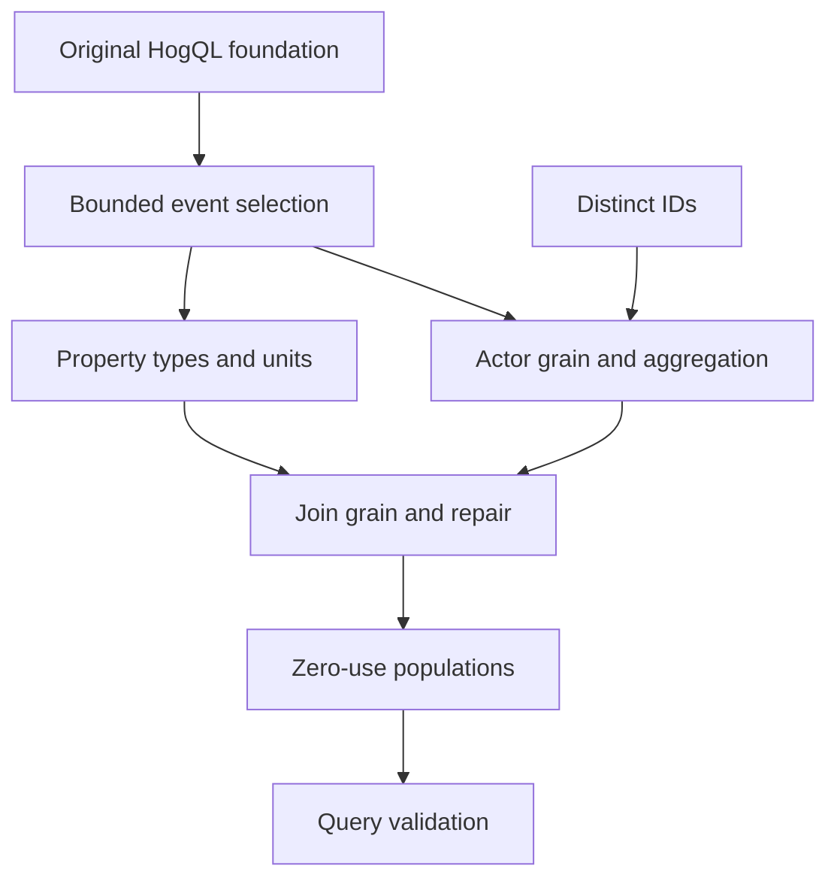

# PostHog TAM content acceptance review

Reviewed 7 October 2026. This report covers the revised source. Publication and production-state verification are handled by the parent agent. The real local database import passed after the final graph correction.

The revised academy is suitable as a data and identity foundation. It now makes applied practice part of passing, separates lesson questions from unfamiliar exam cases, and gives SQL and incident investigation their own small learning steps. It supports evidence-based selection and diagnosis. Independent query authoring, open-ended customer communication, and observed job performance remain outside what its structured answers can prove.

## Scope and identity safety

| Course | Concepts | Steps | Practice | Separate exam cases |
|---|---:|---:|---:|---:|
| Data Models | 7 | 15 | 45 | 30 |
| Data Pipelines | 6 | 12 | 36 | 24 |
| PostHog Data Model | 27 | 51 | 153 | 102 |
| PostHog Ingestion Pipeline | 6 | 10 | 30 | 20 |
| Total | 46 | 88 | 264 | 176 |

All four original course IDs, 10 original section IDs, 37 original concept IDs, 79 original step IDs, and 237 original question IDs remain. Three focused sections and nine atomic concepts were added. No original node was retired or renamed. The identity baseline is recorded in `original-identities.json`.

Each step has three practice questions. The first two scaffold the rule; the third requires an application and has `isTransfer: true`. Two different exam cases follow with `purpose: exam` and `isTransfer: true`. Canonical numerical and ordering items were checked and retained where appropriate. All existing question keys were rechecked after option revisions and position changes.

All 13 sections have exams with an explicit full transfer quota. Every blueprint concept has enough exam questions for two complete sittings without repeating its first-sitting items. The parent engine changes enforce purpose separation and prioritize unseen questions. The final delivery regression passed 5/5 tests.

## Review findings addressed

- Passing after two easy answers: every step has a required applied practice item. The parent executed the actual selector and proved exposure to all 264 practice items, including all 88 applied items, with no exam exposure.
- Later instructions skipped: the parent changed first-time progression to show instruction and worked example before practice. Manual lesson access remains available.
- Weak alternatives and wording cues: all 237 existing items were reviewed; their options and feedback were revised where needed. All 79 original final questions were replaced with concrete cases. Alternatives now target nearby mistakes such as incorrect identity scope, inferred session membership, numeric DISTINCT, lost zero-use populations, status-only delivery claims, and unbounded replay.
- Cost exception: the lesson and applied questions distinguish skipped processing from an existing person link and identified-event classification. The A/B case presents classification and update outcomes consistently across options.
- Person-property time: lessons distinguish occurrence, ingestion, and current profile state. They qualify `person.properties` with default PoE/no override, name `poe.properties` for explicit ingestion snapshots, and name `pdi.person.properties` for current state.
- Verbal-only SQL: six new atomic concepts introduce bounded filters, units/types, actor grain, joins, eligibility preservation, and result validation. They contain query fragments and independently checkable result fixtures.
- Shared lesson/exam bank: 176 separately authored exam cases use unfamiliar evidence. Lesson, review, diagnostic, preview, and exam selection must respect role metadata.
- Abstract architecture: conceptual storage examples remain clearly scoped. Operational cases use capture response bodies, quota evidence, project/region/time scope, ingestion warnings, and redacted escalation packets. They distinguish customer-accessible evidence from internal deployment telemetry.
- Capture ambiguity: the revised question supplies valid initialization, a known actor, and no session middleware before asking for missing session propagation.
- Repeated variants: added cases change evidence, boundary, or operation, rather than only renaming the example. Exact duplicate question text and duplicate answer labels are absent.
- Generic support blocks: step-specific boundaries, worked traces, explicit source titles, and two comparison tables replace the repeated practice-method callout. The parent added Markdown callout rendering and a table regression.
- Overbroad promise: academy and landing copy now name the data/identity scope and concrete capabilities.

The two separately authorized selling-course corrections are also included: `pucm-kp2-p2` now selects option 0, consistent with its stem and explanation; `pi-kp2-p3` acknowledges built-in heatmaps and links current official documentation. The rest of that course was not rewritten.

## New graph and existing learners

The new learning steps are separate concepts. They will not inherit an existing concept's mastered state merely because the original concept already had learners.

The SQL component graph is:

The six new SQL concept IDs are `hogql-event-selection`, `hogql-property-units`, `hogql-actor-grain`, `hogql-join-grain`, `hogql-zero-usage`, and `hogql-query-validation`. The original `hogql-basics` retains its original two steps.

`identity-trace-capstone` depends on identification pitfalls and sessions. `tracking-payload-capstone` depends on capture and identity pitfalls. `quota-recovery-capstone` depends on person processing and scoped storage reasoning. Encompassing edges record which earlier skills these cases exercise.

The quota capstone uses the cross-course concept `data-pipelines:pipeline-tradeoffs`; the verifier rejects a KP ID used as a concept reference.

The offline verifier assumes every original concept is mastered. All nine new identities remain absent from that old mastery map. Four new entry concepts are immediately eligible: event selection, identity trace, tracking payload review, and quota recovery. The remaining five SQL concepts require their new prerequisites. This source-graph simulation is backed by the parent's real local import: a learner with all 37 original concepts mastered received nine new unstarted concept states. All old state rows remained exactly unchanged, and all four course IDs were retained.

## Representative applied cases

1. Two independent $20 orders join to repeated detail rows. The direct join returns 60; the order-key repair returns 40; numeric DISTINCT returns 20. The equal-price fixture prevents the wrong DISTINCT alternative from accidentally satisfying the evidence.
2. Paying accounts A,B,C have usage A,A,C. Starting from eligibility and left joining account-grain usage yields A:2,B:0,C:1 and active rate 2/3. The alternative inner joins remove the inactive denominator member.
3. A January purchase captures free plan, arrives in February with paid profile state, and is queried in March with enterprise current state. The business question determines the required time source; delayed ingestion cannot prove occurrence state without a snapshot/history.
4. A known ID and a fresh unlinked ID both capture with processing=false. The known actor remains identified without a profile update; the fresh actor can be anonymous without creating a profile. Alternatives distinguish classification from mutation.
5. Capture returns 200 with `quota_limited` and bounded searches show missing records. The recovery plan resolves the quota signal, verifies a canary, assesses missing source evidence and duplicate handling, and reconciles a bounded replay.
6. A shared browser logs out without analytics reset. The intervening event keeps userA before userB identifies. The regression must test reset, fresh anonymous activity, and later userB attribution.

## Verification evidence

Run `bun content/academies/posthog-tam/verify-content.ts` from the repository root. It checks source schema, all original identities, unique answer labels and question IDs, role/transfer contracts, blueprint and fresh-retake capacity, the composed graph, explicit concept-target resolution for every graph reference, the new frontier, merged prose tokens, and relational fixtures. Results are recorded in `quality-verification.json`.

The composed academy's mechanical gate is 10/10 with no warnings. A standalone course CLI command cannot resolve references to another course without academy context; its unknown-reference result must not be used to remove legitimate prerequisite edges. The parent verified the real context-aware importer against a local database; it passed after the final edge correction.

The four relational checks reproduce 60/40/20 join totals and the two-row half-open date result. A fifth checks the zero-use account output. SQLite execution validates those relational results. The parent also executed the equal-price join in live HogQL and obtained 60/40/20. The attempted live zero-row person/property-path query timed out; those specific field semantics are checked against current primary documentation, with the PoE override qualification.

All 17 distinct supporting source URLs returned HTTP 200 during the final link pass. Current high-risk sources include:

- [Capture fields and known-ID exception](https://posthog.com/docs/api/capture)
- [Anonymous and identified processing](https://posthog.com/docs/data/anonymous-vs-identified-events)
- [Person processing and property-query paths](https://github.com/PostHog/posthog/blob/master/docs/published/handbook/engineering/person-processing.md)
- [API acceptance, quota and high-volume protection](https://posthog.com/docs/api)
- [Identity behavior and repair cautions](https://posthog.com/docs/product-analytics/identify)
- [Group contracts and limits](https://posthog.com/docs/product-analytics/group-analytics)
- [SQL fields, joins and filters](https://posthog.com/docs/data-warehouse/sql)
- [Relational constraints](https://www.postgresql.org/docs/current/ddl-constraints.html)

The required Math Academy chapters were read before graph changes: 4 (pp.69-80), 13 (pp.207-214), 14 (pp.217-224), 16 (pp.241-245). The new nodes implement smaller steps, explicit prerequisites, gradual scaffold removal, and applied layering. [Official working-draft PDF](https://www.justinmath.com/files/the-math-academy-way.pdf).

## Cue audit and limits

| Shortcut, first option wins ties | Correct | Rate |
|---|---:|---:|
| Longest option, all selectable practice | 53/255 | 20.8% |
| Shortest option, all selectable practice | 96/255 | 37.6% |
| Longest option, required applied practice | 20/88 | 22.7% |
| Shortest option, required applied practice | 25/88 | 28.4% |
| Longest option, exam cases | 57/176 | 32.4% |
| Shortest option, exam cases | 45/176 | 25.6% |

The original longest-option baseline was 61.8%. Correct positions are balanced. These checks measure wording cues, not cognitive depth or observed learner outcomes. The remaining shortest-option advantage in early practice and longest-option advantage in exams should be monitored during further calibration. They do not support a claim that question design is perfect.

Source confidence is high for the checked capture, identity, group, session, and current property-path contracts. Version/deployment caveats are stated where SDK behavior or routing can vary. The review checked every answer key against the stated evidence and inspected the full inventory. It did not reproduce every SDK/version combination or private customer scenario. Several early items intentionally check recognition or a small calculation. Applied cases still use structured selection, so a high score alone cannot certify independent incident handling. The academy's revised scope and landing promise reflect that limit. Selected responses cannot establish independent SQL execution or ownership of a customer incident. The revised bank has no empirical learner calibration yet; difficulty and distractor performance need observed learner data. The parent's final frontend suite passed 509/509 tests, and the source delivery suite passed 5/5.
